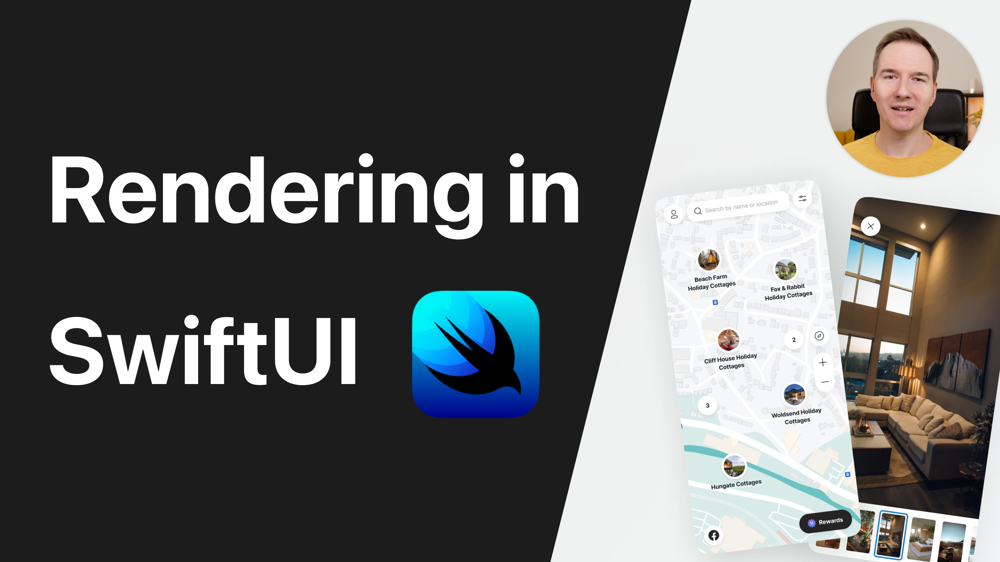

# Learn when SwiftUI re-render views

This is a code from the YT video "Learn when SwiftUI re-render views" 🤗

You will learn how SwiftUI re-render views and how to avoid performance bottlenecks when creating your views. Enjoy 🤓

## Links:
- [Link to the video](https://www.youtube.com/watch?v=GlLyPYWgHEo)